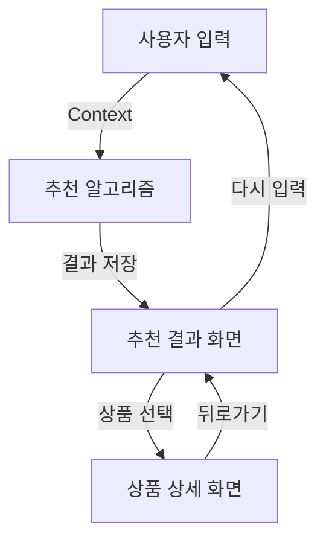

# 🍽️ Smart Meal Planner Frontend

> 예산과 영양소 비율 기반 맞춤형 식단 추천 웹 서비스

## 📋 프로젝트 개요

Smart Meal Planner는 사용자가 설정한 **한 달 식비 예산**과 **영양소 비율(탄수화물/단백질/지방)**을 기반으로 쿠팡에서 구매 가능한 상품들로 구성된 최적의 식단을 추천하는 React 기반 웹 애플리케이션입니다.

### 🎯 주요 기능

- **예산 기반 식단 계획**: 사용자 예산 내에서 최적의 상품 조합 추천
- **영양소 균형 고려**: 탄수화물, 단백질, 지방 비율 맞춤 추천
- **실제 구매 연동**: 쿠팡 상품 링크 제공으로 즉시 구매 가능
- **상세 영양 정보**: 일일 권장 섭취량 대비 영양성분 분석

---

## 🏗️ 기술 스택 & 아키텍처

### Frontend Stack
```json
{
  "framework": "React 18.2.0",
  "language": "TypeScript 4.9.5",
  "ui_library": "Chakra UI 2.8.2",
  "routing": "React Router DOM 6.x",
  "state_management": "Context API",
  "build_tool": "Create React App"
}
```

### 프로젝트 구조
```
src/
├── components/           # React 컴포넌트
│   ├── Layout/          # 레이아웃 관련 컴포넌트
│   │   ├── Header.tsx   # 전역 헤더
│   │   ├── Footer.tsx   # 전역 푸터
│   │   └── Layout.tsx   # 메인 레이아웃 래퍼
│   ├── InputScreen.tsx          # 첫 번째 화면: 입력 폼
│   ├── RecommendationScreen.tsx # 두 번째 화면: 추천 결과
│   └── ProductDetailScreen.tsx  # 세 번째 화면: 상품 상세
├── context/             # 전역 상태 관리
│   └── AppContext.tsx   # 앱 전체 상태 컨텍스트
├── data/                # 목업 데이터 및 비즈니스 로직
│   └── mockProducts.ts  # 쿠팡 상품 데이터 + 추천 알고리즘
├── types/               # TypeScript 타입 정의
│   └── index.ts         # 공통 인터페이스 및 타입
├── App.tsx              # 라우터 설정
└── index.tsx            # 앱 엔트리 포인트
```

---

## 🎨 UI/UX 설계 원칙

### 1. 직관적인 사용자 여정
```
입력 화면 → 추천 결과 → 상품 상세 → 구매 링크
    ↓         ↓         ↓         ↓
  예산설정   식단확인   영양분석   실제구매
```

### 2. 반응형 디자인
- **모바일 우선**: `base` → `md` → `lg` 순차적 적용
- **Grid 시스템**: Chakra UI의 responsive grid 활용
- **유연한 레이아웃**: Container 기반 최대 너비 제한

### 3. 접근성(A11y) 고려사항
- **색상 대비**: WCAG 2.1 AA 등급 준수
- **키보드 네비게이션**: 모든 상호작용 요소 접근 가능
- **스크린 리더**: `aria-label`, `alt` 속성 적절히 활용

---

## 📱 화면별 상세 구현

### 1. 입력 화면 (`InputScreen.tsx`)

#### 핵심 기능
- **예산 입력**: NumberInput with stepper (10,000원 단위)
- **영양소 비율 설정**: 인터랙티브 슬라이더 + 자동 조정 알고리즘
- **실시간 검증**: 총 비율 100% 체크 및 시각적 피드백

#### 주요 알고리즘
```typescript
// 영양소 비율 자동 조정 알고리즘
const handleNutrientChange = (type: keyof NutrientRatios, value: number) => {
  const newNutrients = { ...nutrients };
  newNutrients[type] = value;

  // 100% 초과 시 다른 영양소들을 비례적으로 조정
  if (value + otherTotal > 100) {
    const remainingRatio = 100 - value;
    const scaleFactor = remainingRatio / otherTotal;
    // 나머지 영양소들을 비례적으로 줄임
  }
};
```

#### 상태 관리
```typescript
interface UserInput {
  budget: number;           // 한 달 예산 (원)
  nutrients: {
    carb: number;          // 탄수화물 비율 (%)
    protein: number;       // 단백질 비율 (%)
    fat: number;          // 지방 비율 (%)
  };
}
```

### 2. 추천 결과 화면 (`RecommendationScreen.tsx`)

#### 핵심 기능
- **예산 사용률 시각화**: Progress bar + 잔여 예산 표시
- **식사별 상품 분류**: 아침/점심/저녁 카테고리별 그룹핑
- **상품 카드 UI**: 이미지, 가격, 평점, 배송 정보 한눈에 표시

#### 추천 알고리즘 로직
```typescript
// 영양소 비율 기반 예산 배분
const carbBudget = budget * (carbRatio / 100);
const proteinBudget = budget * (proteinRatio / 100);
const fatBudget = budget * (fatRatio / 100);

// 가성비 기반 상품 정렬
products.sort((a, b) => 
  (b.nutrition.protein / b.price) - (a.nutrition.protein / a.price)
);
```

#### 데이터 플로우
```
UserInput → getRecommendedProducts() → RecommendationResult
    ↓              ↓                        ↓
  예산+비율    필터링+정렬+조합            식사별그룹
```

### 3. 상품 상세 화면 (`ProductDetailScreen.tsx`)

#### 핵심 기능
- **상세 영양성분표**: 일일 권장 섭취량 대비 퍼센트 표시
- **가격 정보**: 할인율 계산 및 원가 대비 절약액 표시
- **구매 연동**: 쿠팡 상품 페이지 직접 연결

#### 영양성분 분석
```typescript
// 일일 권장 섭취량 기준
const dailyValues = {
  calories: 2000,    // kcal
  carb: 130,        // g
  protein: 50,      // g
  fat: 65,          // g
  sodium: 2300,     // mg
};

// 권장량 대비 비율 계산
const getNutrientPercentage = (value: number, dailyValue: number) => 
  Math.round((value / dailyValue) * 100);
```

---

## 🧠 상태 관리 설계

### Context API 구조
```typescript
interface AppContextType {
  // 사용자 입력 데이터
  userInput: UserInput;
  setUserInput: (input: UserInput) => void;
  
  // 추천 결과 데이터
  recommendationResult: RecommendationResult | null;
  setRecommendationResult: (result: RecommendationResult | null) => void;
  
  // 선택된 상품 (상세 화면용)
  selectedProduct: CoupangProduct | null;
  setSelectedProduct: (product: CoupangProduct | null) => void;
  
  // 로딩 상태 관리
  isLoading: boolean;
  setIsLoading: (loading: boolean) => void;
}
```

### 데이터 흐름도


---

## 🎯 비즈니스 로직 & 알고리즘

### 1. 상품 추천 알고리즘

#### 단계별 처리 과정
```typescript
export const getRecommendedProducts = (
  carbRatio: number,
  proteinRatio: number, 
  fatRatio: number,
  budget: number
) => {
  // 1. 영양소 비율 정규화
  const totalRatio = carbRatio + proteinRatio + fatRatio;
  const normalizedCarb = carbRatio / totalRatio;
  const normalizedProtein = proteinRatio / totalRatio;
  const normalizedFat = fatRatio / totalRatio;

  // 2. 예산 배분 (영양소 비율에 따라)
  const carbBudget = budget * normalizedCarb;
  const proteinBudget = budget * normalizedProtein;
  const fatBudget = budget * normalizedFat;

  // 3. 카테고리별 상품 필터링 및 정렬
  const carbProducts = mockProducts
    .filter(p => p.category === '탄수화물')
    .filter(p => p.price <= carbBudget)
    .sort((a, b) => (b.nutrition.carb / b.price) - (a.nutrition.carb / a.price))
    .slice(0, 3);

  // 4. 최종 조합 반환
  return [...carbProducts, ...proteinProducts, ...fatProducts, ...mixedProducts];
};
```

#### 최적화 전략
- **가성비 지표**: `영양소 함량 / 가격` 비율로 정렬
- **예산 제약**: 카테고리별 예산 한도 내에서만 선택
- **다양성 보장**: 각 카테고리에서 최대 3개 상품 선택

### 2. 영양소 균형 계산

```typescript
// 식사별 영양성분 합계 계산
const calculateMealNutrition = (products: CoupangProduct[]) => ({
  calories: products.reduce((sum, p) => sum + p.nutrition.calories, 0),
  carb: products.reduce((sum, p) => sum + p.nutrition.carb, 0),
  protein: products.reduce((sum, p) => sum + p.nutrition.protein, 0),
  fat: products.reduce((sum, p) => sum + p.nutrition.fat, 0),
  sodium: products.reduce((sum, p) => sum + p.nutrition.sodium, 0),
  sugar: products.reduce((sum, p) => sum + p.nutrition.sugar, 0),
});
```

---

## 🔗 외부 API 연동 설계

### 쿠팡 파트너스 연동
```typescript
interface CoupangProduct {
  id: string;
  name: string;
  price: number;
  originalPrice?: number;
  coupangUrl: string;        // 실제 쿠팡 상품 페이지 URL
  isRocketDelivery: boolean; // 로켓배송 여부
  // ... 기타 상품 정보
}
```

### 확장 가능한 API 구조
```typescript
// 향후 실제 API 연동 시 사용할 구조
interface ApiService {
  getProducts: (filters: ProductFilters) => Promise<CoupangProduct[]>;
  getProductDetail: (productId: string) => Promise<CoupangProduct>;
  getNutritionData: (productId: string) => Promise<NutritionInfo>;
}
```

---

## 🎨 디자인 시스템

### Chakra UI 테마 커스터마이징
```typescript
const theme = {
  colors: {
    primary: {
      50: '#E6FFFA',   // 연한 teal
      500: '#319795',  // 메인 teal
      600: '#2C7A7B', // 진한 teal
    }
  },
  components: {
    Button: {
      defaultProps: {
        colorScheme: 'teal',
      }
    }
  }
}
```

### 컬러 팔레트 전략
- **메인 컬러**: Teal (신뢰, 건강한 식단)
- **보조 컬러**: Orange (탄수화물), Red (단백질), Yellow (지방)
- **상태 컬러**: Green (성공), Red (경고), Blue (정보)

### 타이포그래피 계층
```typescript
{
  "heading": "Noto Sans KR, sans-serif",
  "body": "Noto Sans KR, sans-serif",
  "sizes": {
    "xs": "12px",
    "sm": "14px", 
    "md": "16px",
    "lg": "18px",
    "xl": "24px"
  }
}
```

---

## 🚀 성능 최적화

### 1. 컴포넌트 최적화
```typescript
// React.memo로 불필요한 리렌더링 방지
const ProductCard = React.memo(({ product }: { product: CoupangProduct }) => {
  // 상품 카드 UI
});

// useCallback으로 함수 메모이제이션
const handleProductClick = useCallback((product: CoupangProduct) => {
  setSelectedProduct(product);
  navigate(`/product/${product.id}`);
}, [setSelectedProduct, navigate]);
```

### 2. 이미지 최적화
```typescript
// 이미지 lazy loading 및 fallback
<Image
  src={product.imageUrl}
  alt={product.name}
  loading="lazy"
  fallbackSrc="https://via.placeholder.com/300x200?text=상품+이미지"
/>
```

### 3. 번들 최적화
- **Code Splitting**: React Router 기반 페이지별 분할
- **Tree Shaking**: ES6 모듈 import/export 활용
- **Chunk 분석**: webpack-bundle-analyzer로 번들 크기 모니터링

---

## 🧪 테스트 전략

### 1. 단위 테스트 (Unit Tests)
```typescript
// 추천 알고리즘 테스트 예시
describe('getRecommendedProducts', () => {
  test('예산 내에서 상품을 추천해야 함', () => {
    const result = getRecommendedProducts(50, 25, 25, 300000);
    const totalPrice = result.reduce((sum, product) => sum + product.price, 0);
    expect(totalPrice).toBeLessThanOrEqual(300000);
  });

  test('영양소 비율에 따라 적절한 상품을 선택해야 함', () => {
    const result = getRecommendedProducts(70, 20, 10, 300000);
    const carbProducts = result.filter(p => p.category === '탄수화물');
    expect(carbProducts.length).toBeGreaterThan(0);
  });
});
```

### 2. 통합 테스트 (Integration Tests)
```typescript
// 사용자 플로우 테스트
test('사용자가 예산을 입력하고 추천을 받는 전체 플로우', async () => {
  render(<App />);
  
  // 1. 예산 입력
  const budgetInput = screen.getByLabelText('한 달 식비 예산');
  fireEvent.change(budgetInput, { target: { value: '300000' } });
  
  // 2. 영양소 비율 설정
  const carbSlider = screen.getByLabelText('탄수화물');
  fireEvent.change(carbSlider, { target: { value: '50' } });
  
  // 3. 추천 버튼 클릭
  const recommendButton = screen.getByText('식단 추천 받기');
  fireEvent.click(recommendButton);
  
  // 4. 결과 화면 확인
  await waitFor(() => {
    expect(screen.getByText('맞춤 식단 추천 결과')).toBeInTheDocument();
  });
});
```

### 3. E2E 테스트 (End-to-End Tests)
```typescript
// Cypress 기반 전체 시나리오 테스트
describe('Smart Meal Planner E2E', () => {
  it('전체 사용자 여정을 완료할 수 있어야 함', () => {
    cy.visit('/');
    cy.get('[data-testid="budget-input"]').type('300000');
    cy.get('[data-testid="carb-slider"]').invoke('val', 50).trigger('change');
    cy.get('[data-testid="recommend-button"]').click();
    cy.url().should('include', '/recommendations');
    cy.get('[data-testid="product-card"]').first().click();
    cy.url().should('include', '/product/');
  });
});
```

---

## 📊 모니터링 & 분석

### 1. 성능 모니터링
```typescript
// Web Vitals 측정
import { getCLS, getFID, getFCP, getLCP, getTTFB } from 'web-vitals';

function sendToAnalytics(metric) {
  // Google Analytics 또는 다른 분석 도구로 전송
  gtag('event', metric.name, {
    event_category: 'Web Vitals',
    value: Math.round(metric.value),
    custom_parameter_1: metric.id,
  });
}

getCLS(sendToAnalytics);
getFID(sendToAnalytics);
getFCP(sendToAnalytics);
getLCP(sendToAnalytics);
getTTFB(sendToAnalytics);
```

### 2. 사용자 행동 분석
```typescript
// 사용자 상호작용 추적
const trackUserAction = (action: string, properties: Record<string, any>) => {
  // 분석 도구로 이벤트 전송
  analytics.track(action, {
    timestamp: new Date().toISOString(),
    ...properties
  });
};

// 사용 예시
trackUserAction('recommendation_requested', {
  budget: userInput.budget,
  carb_ratio: userInput.nutrients.carb,
  protein_ratio: userInput.nutrients.protein,
  fat_ratio: userInput.nutrients.fat
});
```

---

## 🔒 보안 고려사항

### 1. 입력 검증
```typescript
// 사용자 입력 sanitization
const validateBudget = (budget: number): boolean => {
  return budget > 0 && budget <= 10000000 && Number.isInteger(budget);
};

const validateNutrientRatio = (ratio: number): boolean => {
  return ratio >= 0 && ratio <= 100 && Number.isInteger(ratio);
};
```

### 2. XSS 방지
```typescript
// Chakra UI는 기본적으로 XSS 보호 제공
// 추가적으로 DOMPurify 사용 시
import DOMPurify from 'dompurify';

const sanitizeHTML = (dirty: string): string => {
  return DOMPurify.sanitize(dirty);
};
```

### 3. 환경 변수 관리
```typescript
// .env 파일 구조
REACT_APP_API_BASE_URL=https://api.smartmealplanner.com
REACT_APP_COUPANG_PARTNER_ID=your_partner_id
REACT_APP_ANALYTICS_ID=GA_TRACKING_ID

// 환경별 설정 분리
const config = {
  development: {
    apiUrl: process.env.REACT_APP_API_BASE_URL || 'http://localhost:8000',
  },
  production: {
    apiUrl: process.env.REACT_APP_API_BASE_URL,
  }
};
```

---

## 📚 개발 가이드라인

### 1. 코딩 컨벤션
```typescript
// 컴포넌트 명명 규칙
// ✅ Good
const UserProfileCard: React.FC<UserProfileProps> = ({ user }) => {};

// ❌ Bad  
const userCard = ({ user }) => {};

// 함수 명명 규칙
// ✅ Good
const handleUserClick = () => {};
const calculateTotalPrice = () => {};

// ❌ Bad
const click = () => {};
const calc = () => {};
```

### 2. 폴더 구조 규칙
```
components/
├── common/          # 재사용 가능한 공통 컴포넌트
├── forms/          # 폼 관련 컴포넌트
├── layout/         # 레이아웃 컴포넌트
└── pages/          # 페이지 단위 컴포넌트

hooks/              # 커스텀 훅
utils/              # 유틸리티 함수
constants/          # 상수 정의
```

### 3. Git 워크플로우
```bash
# 브랜치 명명 규칙
feature/user-input-validation
bugfix/recommendation-algorithm-fix
hotfix/critical-security-patch

# 커밋 메시지 컨벤션
feat: 사용자 입력 검증 로직 추가
fix: 추천 알고리즘 예산 계산 오류 수정
docs: README 파일 업데이트
style: 코드 포맷팅 적용
refactor: 상태 관리 로직 리팩토링
test: 단위 테스트 추가
```

---

## 🚀 배포 & 운영

### 1. 빌드 프로세스
```json
{
  "scripts": {
    "build": "react-scripts build",
    "build:analyze": "npm run build && npx webpack-bundle-analyzer build/static/js/*.js",
    "build:staging": "REACT_APP_ENV=staging npm run build",
    "build:production": "REACT_APP_ENV=production npm run build"
  }
}
```

### 2. CI/CD 파이프라인
```yaml
# .github/workflows/deploy.yml
name: Deploy to Production
on:
  push:
    branches: [main]

jobs:
  build-and-deploy:
    runs-on: ubuntu-latest
    steps:
      - uses: actions/checkout@v3
      - name: Setup Node.js
        uses: actions/setup-node@v3
        with:
          node-version: '18'
      - name: Install dependencies
        run: npm ci
      - name: Run tests
        run: npm test -- --coverage --watchAll=false
      - name: Build application
        run: npm run build
      - name: Deploy to S3
        run: aws s3 sync build/ s3://${{ secrets.S3_BUCKET }}
```

### 3. 모니터링 대시보드
```typescript
// 핵심 지표 모니터링
const metrics = {
  userJourney: {
    conversionRate: '입력 → 추천 → 구매 클릭 전환율',
    bounceRate: '첫 페이지 이탈률',
    sessionDuration: '평균 세션 시간'
  },
  performance: {
    loadTime: 'First Contentful Paint',
    interactionTime: 'Time to Interactive',
    cumulativeLayoutShift: 'CLS 점수'
  },
  business: {
    recommendationAccuracy: '추천 정확도',
    coupangClickthrough: '쿠팡 클릭률',
    userRetention: '사용자 재방문율'
  }
};
```

---

## 🔮 향후 확장 계획

### 1. 기능 로드맵
```typescript
// Phase 2: 개인화 기능
interface UserProfile {
  dietary_restrictions: string[];  // 식이 제한사항
  allergies: string[];            // 알레르기 정보
  preferred_brands: string[];     // 선호 브랜드
  purchase_history: string[];     // 구매 이력
}

// Phase 3: AI 추천 엔진
interface MLRecommendation {
  user_clustering: UserCluster;    // 사용자 군집 분석
  collaborative_filtering: RecommendationScore[]; // 협업 필터링
  content_based_filtering: ProductSimilarity[];  // 콘텐츠 기반 필터링
}

// Phase 4: 소셜 기능
interface SocialFeatures {
  meal_sharing: SharedMeal[];      // 식단 공유
  community_reviews: CommunityReview[]; // 커뮤니티 리뷰
  friend_recommendations: FriendRecommendation[]; // 친구 추천
}
```

### 2. 기술 스택 진화
```typescript
// 상태 관리 진화: Context API → Redux Toolkit
// 스타일링 진화: Chakra UI → Tailwind CSS + Headless UI
// 테스팅 진화: Jest + RTL → Vitest + Playwright
// 빌드 도구 진화: CRA → Vite
// 배포 진화: S3 → Vercel/Netlify
```

### 3. 성능 최적화 로드맵
```typescript
// 프론트엔드 최적화
- React Query를 통한 서버 상태 관리
- Virtual Scrolling으로 대량 상품 리스트 처리
- Service Worker를 통한 오프라인 지원
- WebAssembly를 활용한 복잡한 영양 계산 로직 최적화

// 백엔드 연동 준비
- GraphQL API 설계
- 실시간 가격 정보 업데이트 (WebSocket)
- CDN을 통한 이미지 최적화
- Redis 캐싱을 통한 추천 결과 캐싱
```

---

## 📞 팀 커뮤니케이션

### 문서 업데이트 정책
- **코드 변경 시**: 관련 문서 동시 업데이트 필수
- **새 기능 추가 시**: 기능 명세서 및 API 문서 작성
- **주간 리뷰**: 매주 금요일 문서 일관성 검토

---

**📝 문서 버전**: v1.0.0  
**📅 최종 업데이트**: 2025.08.25  
**👨‍💻 작성자**: 김승빈
